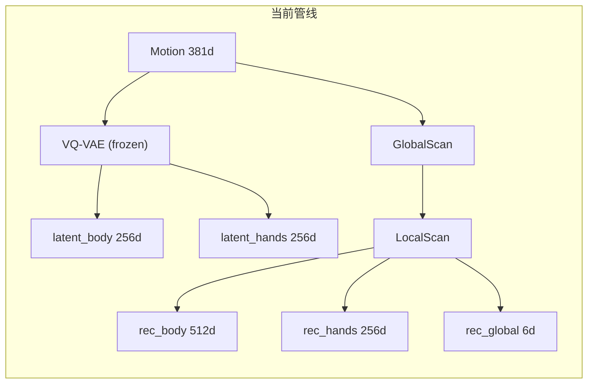

# FFT 周期解耦优化方案

## 第一步：可行性评估

### 1.1 数据维度兼容性 -- 可行

**MambaTalk 当前数据布局**（MHR 连续表示，[mambatalk_mhr_new_trainer.py](MambaTalk_new_512_proj_global_v1/mambatalk_mhr_new_trainer.py)）：

```
LMDB 缓存: body_cont(260) + hand(108) + global_rot_6d(6) + cam_t(3) + contact(4) = 381d
```

**HIP 论文 PD 模块的输入**：世界坐标系下 body(9 关节 x 3 = 27d) + hand(38 关节 x 3 = 114d) = 141d 的关节**速度**。

**关键差异与对齐策略**：

MambaTalk 使用的数据并非 BEAT2 原始 mocap 格式，而是经过 **SAM-3D-Body** 管线从视频中回归得到的 **MHR (Momentum Human Rig)** 结构。npz 文件中的 `pred_joint_coords`（N, 127, 3）是 SAM-3D-Body 模型对视频预测的 3D 关节世界坐标（通过 `mhr_head.py` 的 `mhr_forward` 前向运动学计算得到），而非动作捕捉的 ground truth。当前 LMDB 缓存构建时仅用它来计算脚部接触 (contacts)，**未将坐标本身存入**。

为与 HIP 完全对齐，方案为：**在 LMDB 缓存构建时，额外从 `pred_joint_coords` 计算选定关节的帧间速度并存入缓存**。虽然数据来源是模型预测而非 mocap，但 SAM-3D-Body 在 BEAT2 上的关节预测精度较高，足以提取有意义的周期结构。

**MHR 127 关节结构**（源自 [mhr_head.py](sam_3d_body/sam_3d_body/models/heads/mhr_head.py)）：

- `joint_rotation`: (127, 3, 3) — 127 个 MHR 骨骼关节
- `hand_joint_idxs_left`: 27 个索引 — 左手关节在 127 中的位置
- `hand_joint_idxs_right`: 27 个索引 — 右手关节在 127 中的位置
- 已确认的身体关节索引：40=右前臂 (r_lowarm)、41=右手腕 (r_wrist)、76=左前臂 (l_lowarm)、77=左手腕 (l_wrist)
- 127 = body_world (1) + 126 MHR 骨骼关节（关节名定义在 MHR FBX 资产中）

**关节选择策略**：

Phase Pre 中从 MHR 预训练 checkpoint 加载 `hand_joint_idxs_left` 和 `hand_joint_idxs_right`（各 27 个）以确定手部关节的精确索引。对于身体关节，排除下半身（腿部）和辅助关节（twist/null），选取脊柱、肩、肘、腕、颈部等上半身关键关节。预计选出的关节数约 **J = 40-50 个**，对应 velocity 维度 = J x 3 = 120-150d，与 HIP 的 141d 量级一致。若关节映射仍不确定，可回退到使用**全部 127 关节**（381d）的方案——PD 的 1D Conv 编码器会自动学习关注最相关的关节维度。

### 1.2 计算图兼容性 -- 可行

当前模型管线的数据流与 FFT 模块接入位置：




FFT 模块接入策略为 **A+C 组合**（与 HIP 原文的两阶段设计一致）：

- **位置 A**（独立预训练）：PD 模块对从 LMDB 新增字段加载的关节速度 (bs, T, J*3) 做自编码重建，学习周期流形参数 (A, F, B, S)。与主模型完全解耦，不影响现有训练管线。
- **位置 C**（推理增强）：在 LocalScan 输出阶段之后，新增周期预测分支（LSTM + MoE），预测当前语音对应的周期参数，构造正弦信号叠加到解码后的 body/hands 运动上。

这一设计对现有计算图的侵入性最小——GlobalScan/LocalScan 内部逻辑完全不变，仅在输出层外部添加增强。

### 1.3 损失函数兼容性 -- 可行

现有损失体系包含：Latent MSE、速度 L1、加速度 L1、Codebook 分类、Mask 自监督

HIP 的 PD 模块需新增：

- PD 重建损失（仅 PD 预训练阶段）：`L1(vel_bh, vel_bh_hat)` + `L1(delta(vel_bh - vel_bh_hat))`
- 周期参数监督损失（集成阶段）：`MSE(Z, Z_hat)` for Z in {A, F, B, S}

这些损失与现有损失正交，可直接加权求和。需注意 PD 模块的重建目标是**关节速度空间**，而主模型的损失在**旋转参数/latent 空间**，两者不冲突。

### 1.4 训练开销评估 -- 可接受

- **LMDB 重建**：一次性开销，约 1-2 小时（遍历所有 npz，计算速度并写入新 LMDB）。cache 体积增量 = J*3 * N_frames * 4 bytes，约占现有 cache 的 35-40%
- **PD 预训练**：轻量级自编码器（1D Conv + FFT），约占主模型 5% 参数量。HIP 原文在单卡 RTX 3090 上 200 epoch 即可完成
- **主训练增量**：新增周期预测分支（3层 FC + LSTM + MoE Expert）约增加 2-3% 参数量；FFT 前向计算 O(T log T)，T=64 时极快
- **显存增量**：PD 模块冻结后仅需前向传播（无梯度），增量约 50-100MB；周期预测分支梯度增量约 200MB

### 1.5 结论

**当前训练框架完全适合执行该优化**。理由如下：

1. 原始 npz 数据中已包含 `pred_joint_coords` (N, 127, 3)，可直接计算世界坐标关节速度，与 HIP 论文对齐
2. LMDB 缓存架构支持扩展存储新字段，仅需修改 cache 构建逻辑
3. 模块化的 GlobalScan/LocalScan 架构支持非侵入式外挂增强模块
4. 现有损失函数体系可自然扩展，关节速度空间与旋转参数空间互不干扰
5. 训练开销增量可控（<10%）
6. PyTorch 原生支持 `torch.fft`（1.7+），无需额外依赖

---

## 第二步：优化方案设计

### 工作目录与训练规范

**项目拷贝**：从 `/data1/yangzhuowei/MambaTalk_new_512_proj_global_v1` 拷贝为 `/data1/yangzhuowei/MambaTalk_new_512_proj_global_v2`，后续所有代码修改和训练均在 v2 副本上进行，保持 v1 原始代码不变。

**GPU 检查与 tmux 训练**：每次启动训练前：

1. 执行 `nvidia-smi` 检查各 GPU 的显存使用情况，选择空闲 GPU
2. 在 tmux session 中启动训练，确保训练进程在 SSH 断开后仍持续运行
3. tmux session 命名规范：`tmux new -s pd_pretrain`（PD 预训练）、`tmux new -s mambatalk_v2`（MambaTalk 训练）等
4. 训练命令示例：`CUDA_VISIBLE_DEVICES=<空闲GPU> python train.py ...`

### 2.0 数据预处理：关节速度计算与 LMDB 扩展

这是整个方案的前置基础，需要在 PD 预训练之前完成。

**2.0.1 关节子集确定**

从 SAM-3D-Body 127 关节中选取**上半身 + 手部**关节。需排除：

- 下半身关节（索引 2-32）：腿部运动对 co-speech gesture 周期性贡献不大
- twist 辅助关节（如 upleg_twist、lowarm_twist）：为骨骼蒙皮服务，不是独立运动自由度
- null 终端关节（如 pinky_null、ring_null）：无实际运动信息
- 面部关节（jaw、tongue、eye）：face 通道在当前 MambaTalk 中未启用

预计保留约 **J = 47 个关节**，对应速度维度 = 47 * 3 = **141d**（恰好与 HIP 的 141d 一致）。

**2.0.2 LMDB 缓存扩展**

修改 [dataloaders/beat_mhr.py](MambaTalk_new_512_proj_global_v1/dataloaders/beat_mhr.py) 的 cache 构建逻辑：

```python
# 现有 cache 布局: pose_each_file (N, 381)
# 新增: joint_velocity (N, J*3)

joints_all = mhr['joints']  # (N, 127, 3)，已在 load_mhr_native 中加载
selected_joints = joints_all[:, SELECTED_JOINT_IDXS, :]  # (N, J, 3)
joint_velocity = np.zeros_like(selected_joints)
joint_velocity[1:] = selected_joints[1:] - selected_joints[:-1]  # 帧间差分 = 速度
joint_velocity = joint_velocity.reshape(N, -1)  # (N, J*3)

# 与 pose 一起序列化存入 LMDB
value = pyarrow.serialize([pose, audio, facial, shape, word, emo, sem, vid, trans, joint_velocity])
```

新 LMDB 布局：原有 9 个字段 + `joint_velocity` = 10 个字段。

**2.0.3 滑窗切片对齐**

训练时的滑窗切片（stride=20, pose_length=64）需同步应用于 `joint_velocity`。在 `CustomDataset.__getitem`__ 中取出后切片即可，与现有 pose 的处理方式一致。

### 2.1 整体架构

```mermaid
flowchart TB
    subgraph phasePre["预处理：LMDB 扩展"]
        NPZ["原始 npz\npred_joint_coords\n(N,127,3)"] --> JointSelect["关节子集选择\n47 关节"]
        JointSelect --> VelCalc["帧间差分\n计算速度"]
        VelCalc --> LMDB["存入 LMDB\njoint_velocity\n(N,141)"]
    end

    subgraph phase1["阶段一：PD 模块预训练"]
        JointVel["joint_velocity\n(bs,T,141)"] --> EncoderEd["Encoder Ed: 1D Conv\n141d -> N=10 channels"]
        EncoderEd --> PeriodicBranch["周期分支\nFFT -> A,F,B,S\n-> sin reconstruction"]
        EncoderEd --> NonPeriodicBranch["非周期分支\nConv + BN"]
        PeriodicBranch --> AddFuse["加法融合"]
        NonPeriodicBranch --> AddFuse
        AddFuse --> DecoderDbh["Decoder Dbh: 1D Conv\nN -> 141d"]
        DecoderDbh --> ReconLoss["L_rec + L_vel"]
    end

    subgraph phase2["阶段二：集成到 MambaTalk"]
        PDFrozen["PD (frozen)\n对 GT 关节速度提取\n伪标签 A,F,B,S"] --> SupervisionLoss["MSE(Z, Z_hat)"]
        MultiModal["LocalScan cross-attn\nglobal_motions 768d"] --> PeriodicPredictor["周期预测分支\nLSTM + MoE Expert"]
        PeriodicPredictor --> PredAFBS["预测 A_hat,F_hat,\nB_hat,S_hat"]
        PredAFBS --> SupervisionLoss
        PredAFBS --> SinReconstruct["sin 重建周期元素\n(bs,T,N)"]
        SinReconstruct --> PeriodDecode["1D Conv 映射\nN -> body(260d)+hand(108d)"]
        PeriodDecode --> Enhancement["叠加到 VQ-VAE\n解码后的运动"]
    end
```




### 2.2 PD 模块技术细节

PD 模块以**关节速度**为输入/输出，与 HIP 原文对齐。

**Encoder Ed**（1D Conv 降维）：

```python
Ed = Sequential(
    Conv1d(141, 128, kernel_size=3, stride=1, padding=1), BatchNorm1d(128), LeakyReLU,
    Conv1d(128, 64, kernel_size=3, stride=1, padding=1), BatchNorm1d(64), LeakyReLU,
    Conv1d(64, N, kernel_size=3, stride=1, padding=1)   # N=10
)
```

输入 `(bs, T, 141)` -> 转置 -> Conv1d -> 输出 `(bs, N, T)` -> 转置 -> `(bs, T, N)`

**周期分支**（对特征 y 的每个通道 z = 1..N）：

- Step 1：`Q = torch.fft.rfft(y_z, dim=-1)` 时域转频域
- Step 2：`P = Q.real**2 + Q.imag**2` 功率谱
- Step 3：提取参数
  - `A_i = sqrt(2/T * sum(P[i, 1:K+1]))` 振幅
  - `F_i = sum(alpha * P[i]) / sum(P[i])` 主频率（alpha 为 [0, K/T] 均匀向量）
  - `B_i = Q[i, 0].real / T` 直流偏置
- Step 4：`(sx, sy) = FC(y_i)`; `S_i = atan2(sy, sx)` 可学习相位偏移
- Step 5：`y_hat_p = A * sin(2*pi*(F*t - S)) + B` 正弦重建

**非周期分支**：

```python
Enp = Sequential(
    Conv1d(N, N*2, kernel_size=3, padding=1), BatchNorm1d(N*2), LeakyReLU,
    Conv1d(N*2, N, kernel_size=3, padding=1), BatchNorm1d(N)
)
```

**Decoder Dbh**：

```python
Dbh = Sequential(
    Conv1d(N, 64, kernel_size=3, padding=1), LeakyReLU,
    Conv1d(64, 128, kernel_size=3, padding=1), LeakyReLU,
    Conv1d(128, 141, kernel_size=3, padding=1)
)
```

**损失函数**：

```
L_pd = ||vel_bh - vel_bh_hat||_1 + lambda_u * ||delta(vel_bh - vel_bh_hat) / delta_t||_1
```

其中 `lambda_u` 建议初始值 0.5，与 HIP 一致。

### 2.3 MambaTalk 集成方案

集成位置在 [models/mambatalk.py](MambaTalk_new_512_proj_global_v1/models/mambatalk.py) 的 LocalScan 输出阶段之后。

**核心思路**：PD 模块在**关节速度空间**工作，但 MambaTalk 在**旋转参数空间**输出。为桥接两个空间，周期增强分支需要一个从 N 通道正弦信号到运动参数空间的映射层。

**周期预测分支**（新增于 MambaTalk 主模型或 trainer 中）：

```python
class PeriodicPredictor(nn.Module):
    def __init__(self, input_dim=768, hidden_dim=256, n_channels=10, n_experts=4):
        self.lstm = nn.LSTM(input_dim, hidden_dim, num_layers=1, batch_first=True)
        # Gate network: 预测 expert 权重
        self.gate = nn.Sequential(
            nn.Linear(hidden_dim, hidden_dim), nn.ReLU(),
            nn.Linear(hidden_dim, hidden_dim), nn.ReLU(),
            nn.Linear(hidden_dim, n_experts), nn.Softmax(dim=-1)
        )
        # Expert networks: 各预测 A, F, B, S
        self.experts = nn.ModuleList([
            nn.Sequential(
                nn.Linear(hidden_dim, hidden_dim), nn.ReLU(),
                nn.Linear(hidden_dim, hidden_dim), nn.ReLU(),
                nn.Linear(hidden_dim, n_channels * 4)  # A, F, B, S 各 n_channels 维
            ) for _ in range(n_experts)
        ])
        self.fc_phase = nn.Linear(hidden_dim, n_channels * 2)  # (sx, sy) for S
```

**增强流程**：

1. 从 LocalScan 的 cross-attention 输出（global_motions, 768d）提取多模态融合特征
2. 通过 PeriodicPredictor 的 LSTM + MoE 预测周期参数 (A_hat, F_hat, B_hat, S_hat)
3. 用预测参数构造正弦信号：`periodic_element = A_hat * sin(2*pi*(F_hat*t - S_hat)) + B_hat`，形状 (bs, T, N)
4. 通过 1D Conv 将 N 通道映射回运动参数空间：分别映射到 body(260d) 和 hand(108d)
5. 与 rec_body/rec_hands 的 VQ-VAE 解码结果在运动参数空间相加

**新增损失**（仅在主训练阶段，加在 `_g_training` 中）：

```python
# 用冻结的 PD 模块从 GT 关节速度提取伪标签
with torch.no_grad():
    A_gt, F_gt, B_gt, S_gt = pd_module.extract_params(gt_joint_velocity)

# 周期参数预测损失
L_periodic = MSE(A_hat, A_gt) + MSE(F_hat, F_gt) + MSE(B_hat, B_gt) + MSE(S_hat, S_gt)
L_total = L_original + lambda_p * L_periodic  # lambda_p 建议 0.1 ~ 0.5
```

### 2.4 需要新增或修改的文件

以下文件均位于 `/data1/yangzhuowei/MambaTalk_new_512_proj_global_v2/`（v1 的副本）：

- **修改** `dataloaders/beat_mhr.py`：在 cache 构建时从 `pred_joint_coords` 计算选定关节的帧间速度并存入 LMDB；在 `__getitem__` 中取出 joint_velocity
- **新增** `models/periodicity_module.py`：PD 自编码模块（Encoder, PeriodicBranch, NonPeriodicBranch, Decoder），输入/输出为关节速度
- **新增** `pd_trainer.py`：PD 预训练 Trainer，继承 BaseTrainer
- **新增** `configs/pd_config.yaml`：PD 预训练配置（N, lambda_u, lr, selected_joint_idxs 等）
- **修改** `models/mambatalk.py`：新增 PeriodicPredictor（LSTM + MoE）+ 周期元素到运动空间的映射层 + 叠加逻辑
- **修改** `mambatalk_mhr_new_trainer.py`：(1) 加载冻结 PD 模块 (2) 在 `_load_data` 中读取 joint_velocity 并调 PD 提取伪标签 (A, F, B, S) (3) 在 `_g_training` 中计算周期参数监督损失 (4) 在 `_g_test` 中添加周期增强逻辑
- **修改** `configs/mambatalk_mhr_new.yaml`：新增 pd_checkpoint, lambda_p, n_channels, selected_joint_idxs 等配置项

### 2.5 分阶段实施计划

**Phase Init：项目拷贝**

```bash
cp -r /data1/yangzhuowei/MambaTalk_new_512_proj_global_v1 /data1/yangzhuowei/MambaTalk_new_512_proj_global_v2
```

后续所有操作均在 `/data1/yangzhuowei/MambaTalk_new_512_proj_global_v2` 中进行。

**Phase Pre：数据预处理与关节映射（0.5-1 天）**

- Step 1：从 MHR 预训练 checkpoint 中加载 `hand_joint_idxs_left` (27个) 和 `hand_joint_idxs_right` (27个)，确定手部关节在 127 中的精确索引
- Step 2：加载一个样本 npz 文件的 `pred_joint_coords` (N, 127, 3)，3D 可视化所有 127 个关节位置，通过空间位置标注语义（脊柱、肩、肘等），结合已知索引（40=r_lowarm, 41=r_wrist, 76=l_lowarm, 77=l_wrist）交叉验证
- Step 3：确定 `SELECTED_JOINT_IDXS`（上半身 body 关节 + 左右手共 54 个手部关节），定义为代码中的常量
- Step 4：修改 `dataloaders/beat_mhr.py` 的 LMDB 构建逻辑，从 `pred_joint_coords` 选取子集关节、计算帧间速度并存入
- Step 5：重建 LMDB 缓存（注意：数据来源是 SAM-3D-Body 从视频回归的预测坐标，非 mocap ground truth）
- 回退方案：若关节语义映射不确定性过大，使用**全部 127 关节**的速度 (381d) 作为 PD 输入

**Phase 0：PD 模块实现（0.5 天）**

- 新建 `models/periodicity_module.py`，实现 PD 自编码器
- 输入维度从 HIP 的 141d 调整为实际确定的 J*3 维
- 编写单元测试：构造已知正弦信号，验证 A/F/B/S 提取精度

**Phase 1：PD 模块预训练（1 天）**

- 新建 `pd_trainer.py` 和 `configs/pd_config.yaml`
- 从新 LMDB 中加载 `joint_velocity` 作为 PD 训练数据
- 训练前：`nvidia-smi` 检查空闲 GPU
- 在 tmux 中启动训练：

```bash
  tmux new -s pd_pretrain
  CUDA_VISIBLE_DEVICES=<空闲GPU> python pd_trainer.py --config configs/pd_config.yaml
  

```

- 训练至收敛（建议 200 epoch，batch_size=256，lr=5e-4）
- 验证指标：重建 L1 误差、相空间可视化（2D PCA 投影，验证是否出现规则环形/螺旋结构）

**Phase 2：集成到 MambaTalk（1.5 天）**

- 修改 `models/mambatalk.py`：添加 PeriodicPredictor + MoE Expert + 映射层
- 修改 `mambatalk_mhr_new_trainer.py`：
  - 在 `__init`__ 中加载预训练 PD 模块并冻结
  - 在 `_load_data` 中读取 `joint_velocity` 并调 PD 提取伪标签
  - 在 `_g_training` 中计算 L_periodic 损失
  - 在 `_g_test` 中用 PeriodicPredictor 生成周期元素并叠加
- 修改配置文件添加新超参数

**Phase 3：训练验证与调优（2 天）**

- 训练前：`nvidia-smi` 检查空闲 GPU
- 在 tmux 中启动训练：

```bash
  tmux new -s mambatalk_v2
  CUDA_VISIBLE_DEVICES=<空闲GPU> python train.py --config configs/mambatalk_mhr_new.yaml
  

```

- 先用小规模快速实验（20 epoch）验证训练稳定性和损失收敛
- 调优 lambda_p（周期损失权重）和 N（通道数）
- 完整训练 150 epoch，与 baseline 对比 FGD/Diversity/BeatAlign
- 可视化分析：周期参数分布、生成手势的运动轨迹对比

### 2.6 风险与缓解

- **关节映射**：127 关节的完整名称定义在 MHR FBX 资产中，SAM-3D-Body 代码仅包含部分索引（手部 27+27、wrist 41/77 等）。缓解：Phase Pre 中从 checkpoint 加载 `hand_joint_idxs_left/right`，结合 3D 可视化确定语义；若仍有歧义，回退到使用全部 127 关节
- **数据来源为模型预测而非 mocap**：`pred_joint_coords` 是 SAM-3D-Body 从视频回归的预测值，可能存在帧间抖动和预测噪声。缓解：(1) 帧间速度差分本身可部分过滤高频噪声 (2) PD 模块的非周期分支会吸收这些噪声 (3) 若噪声严重，可在计算速度前对关节坐标做时域平滑（如 Savitzky-Golay 滤波）
- **关节速度与旋转参数的空间差异**：PD 在速度空间学习周期先验，但增强需映射回旋转参数空间。缓解：使用可学习的 1D Conv 映射层桥接两个空间，端到端训练时梯度可自动调整映射关系
- **LMDB 缓存重建代价**：需要重建所有 LMDB 缓存。缓解：一次性操作（约 1-2 小时），可保留旧缓存做 A/B 切换
- **FFT 在短序列 (T=64) 上频率分辨率有限**：T=64 at 30fps 约 2.13s，Nyquist 频率 15Hz，频率分辨率 0.47Hz。缓解：手势的主要周期模式在 1-3Hz 范围，64 帧足以捕获 2-6 个完整周期
- **PD 预训练与主模型分布不匹配**：PD 学习的是 GT 运动的周期结构，但主模型生成的运动分布可能不同。缓解：Phase 2 可考虑对 PD encoder 做 fine-tune（小学习率），而非完全冻结
- **通道数 N 的过拟合**：HIP 论文指出增加 N 可能过拟合。缓解：从 N=5 开始实验，逐步增加到 10，监控训练/验证损失的 gap

